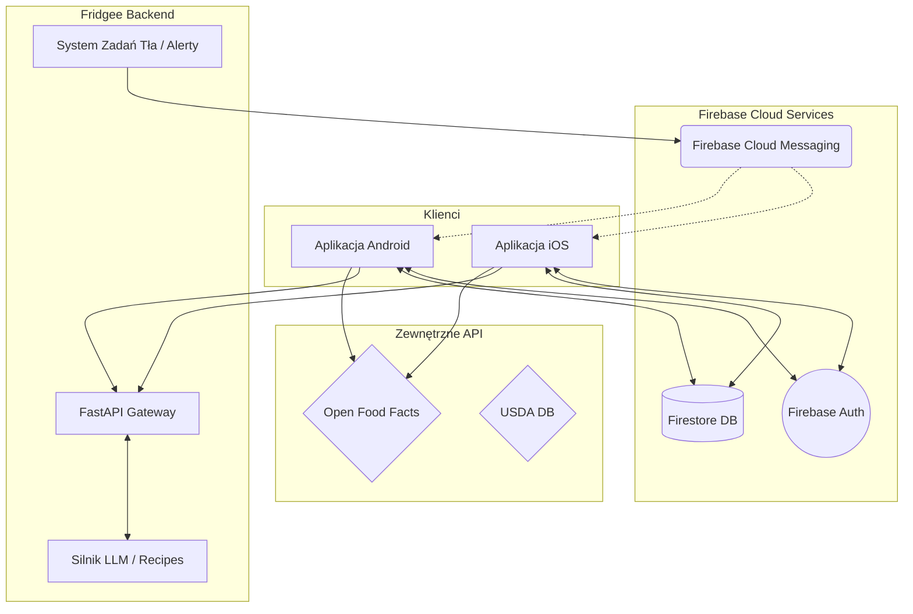
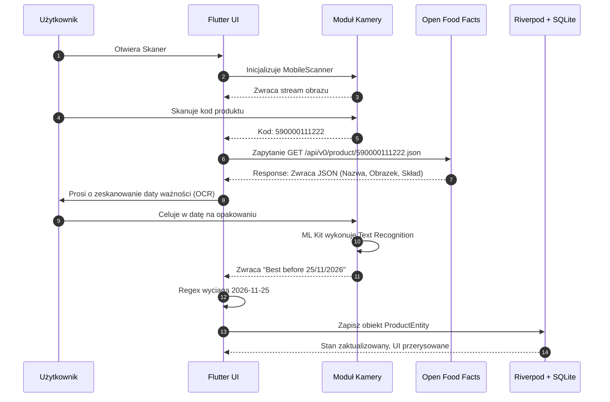
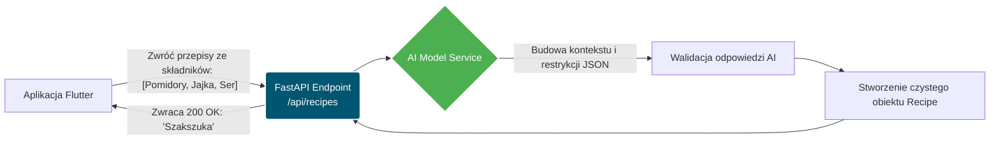
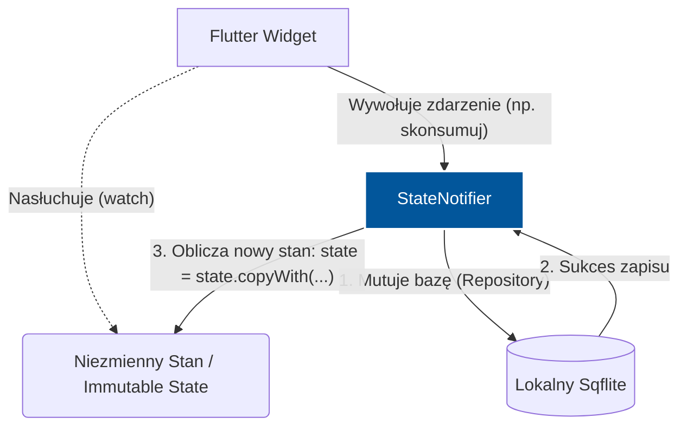

<div align="center">
  <h1>🍏 Fridgee</h1>
  <p><b>Zintegrowany Ekosystem Zarządzania Żywnością • Zero Waste • AI Recipes • Smart Barcode Scanner</b></p>
  
  [](https://flutter.dev/)
  [](https://fastapi.tiangolo.com/)
  [](https://www.python.org/)
  [](https://firebase.google.com/)
  [](https://opensource.org/licenses/MIT)
</div>

<br/>

**Fridgee** to zaawansowany i nowoczesny system wspierający codzienne zarządzanie domowymi zapasami żywności. Aplikacja została zaprojektowana w odpowiedzi na rosnący globalny problem marnowania jedzenia. Dostarcza użytkownikom kompleksowe narzędzia do organizacji kuchni, śledzenia terminów ważności produktów oraz – dzięki wsparciu sztucznej inteligencji – generowania spersonalizowanych przepisów kulinarnych zapobiegających wyrzucaniu dobrego jedzenia.

Niniejsza dokumentacja jest kompletnym kompendium wiedzy o projekcie, przeznaczonym zarówno dla użytkowników, jak i dla programistów, architektów oprogramowania oraz wszystkich osób zaangażowanych w rozwój platformy.

---

## 🌱 1. Wstęp i Geneza Projektu

### Problem: Marnowanie Żywności
Statystyki są alarmujące – co roku miliony ton żywności trafiają na śmietnik, z czego ogromna część to odpady z gospodarstw domowych. Marnujemy jedzenie głównie z dwóch powodów:
1. **Brak świadomości** co do zawartości własnej lodówki i szafek (kupujemy coś, co już mamy).
2. **Brak inspiracji** (nie wiemy, co ugotować ze składników, których termin ważności zaraz mija).

### Rozwiązanie: Fridgee i Filozofia "Zero Friction"
Tradycyjne aplikacje do prowadzenia inwentaryzacji żywności zawodzą, ponieważ wymagają od użytkownika żmudnego, ręcznego wpisywania każdego produktu, jego wagi, kategorii i daty przydatności. **Fridgee opiera się na filozofii "Zero Friction" (Zero Tarcia).** Oznacza to, że proces wprowadzania danych ma trwać zaledwie ułamki sekund. Wykorzystujemy do tego zaawansowane skanery kodów kreskowych, analizę obrazu (OCR z Google ML Kit) oraz zintegrowane zewnętrzne bazy danych (takie jak Open Food Facts), aby aplikacja wykonała 95% pracy za użytkownika.

---

## 👥 2. Dla kogo jest ten system?

Projekt Fridgee został zaprojektowany z myślą o szerokim spektrum użytkowników końcowych:
*   **Rodziny i Gospodarstwa Domowe:** Współdzielona lodówka pozwala na synchronizację w czasie rzeczywistym. Każdy domownik widzi, co aktualnie znajduje się w zapasach i czego brakuje.
*   **Osoby dbające o budżet:** Mniej wyrzuconego jedzenia to realne, mierzalne oszczędności rzędu setek złotych miesięcznie.
*   **Osoby aktywne zawodowo:** Szybkie zakupy bez zastanawiania się "czy mam w domu mleko?" oraz gotowe pomysły na szybki obiad wygenerowane przez AI podczas powrotu z pracy.
*   **Entuzjaści ekologii:** Narzędzie realnie zmniejszające ślad węglowy gospodarstwa domowego.

---

## ✨ 3. Szczegółowy Opis Funkcjonalności

Ekosystem Fridgee składa się z wielu zazębiających się modułów, które razem tworzą płynne doświadczenie użytkownika.

### 3.1 Inteligentne Zarządzanie Zapasami (Smart Inventory)
Aplikacja posiada dedykowany widok głównej "Lodówki" (oraz "Spiżarni" i "Zamrażarki"). 
*   **Błyskawiczne dodawanie produktów:** Za pomocą skanera aparat telefonu odczytuje kod kreskowy. System wysyła kod do zewnętrznego API, skąd natychmiast wracają dane o marce, nazwie, wadze i zdjęciu produktu.
*   **Inteligentny OCR Daty Ważności:** Zamiast ręcznie wybierać datę z kalendarza, użytkownik kieruje aparat na nadruk na opakowaniu. Google ML Kit w ułamku sekundy przetwarza obraz na tekst, a algorytm wyrażeń regularnych wyciąga datę i formatuje ją do standardu ISO.
*   **Kategoryzacja:** System automatycznie przypisuje produkty do kategorii (Nabiał, Mięso, Warzywa, etc.), ułatwiając nawigację.

### 3.2 Moduł AI Recipes (Sztuczna Inteligencja Kulinarna)
Gdy aplikacja zauważy, że za 2 dni kończy się ważność boczku, jajek i śmietany, nie tylko wysyła powiadomienie z alertem, ale od razu proponuje rozwiązanie.
*   Silnik backendowy komunikuje się z nowoczesnymi modelami językowymi (LLM), budując zaawansowany prompt uwzględniający listę składników zagrożonych zepsuciem.
*   Aplikacja zwraca krok po kroku przygotowany przepis kulinarny, spersonalizowany pod kątem tego, co w 100% znajduje się w domowych zapasach, unikając sytuacji w których brakuje użytkownikowi połowy składników do "uratowania" jednego produktu.

### 3.3 Dynamiczne Listy Zakupów i Współdzielenie
*   **Auto-generowanie:** Produkty, które się skończyły, mogą trafiać jednym kliknięciem z "Lodówki" do "Listy Zakupów".
*   **Cloud Sync:** Dzięki Firebase (Firestore) lista zakupów aktualizuje się na urządzeniach wszystkich domowników w czasie rzeczywistym. Ktoś będący w sklepie odhacza pozycję, a osoba w domu widzi to w ułamku sekundy na swoim ekranie.

### 3.4 Grywalizacja i Statystyki (Dashboard)
Aplikacja ma angażować. Udostępniamy dashboard ze statystykami:
*   Ilość uratowanych kilogramów żywności w danym miesiącu.
*   Szacunkowa kwota zaoszczędzonych pieniędzy.
*   Zdobywanie odznak i poziomów za nieprzerwane "Zero Waste Streaks".

---

## 🏗 4. Architektura Systemu i Decyzje Technologiczne

Budując tak zaawansowany system, musieliśmy dobrać technologie zapewniające z jednej strony skalowalność i bezpieczeństwo danych, a z drugiej maksymalnie szybki rozwój iteracyjny.

### 4.1 Frontend Mobilny: Flutter & Dart
*   **Dlaczego Flutter?** Pozwala nam pisać kod raz i wdrażać piękne, natywne aplikacje o stałej wydajności 60+ FPS zarówno na urządzenia z systemem Android, jak i iOS.
*   **State Management:** Wybraliśmy **Riverpod 2.x**. Gwarantuje on najwyższy stopień przewidywalności stanu i bezpieczeństwo typów (Type Safety) podczas kompilacji.
*   **Architektura Frontendu:** Opieramy się na zasadach Feature-First Architecture. Kod jest dzielony nie według typu pliku (modele, widoki, kontrolery), ale według ficzera (np. `/features/scanner`, `/features/recipes`).

### 4.2 Backend AI: Python & FastAPI
*   **Dlaczego FastAPI?** Serwowanie usług opartych o sztuczną inteligencję, przetwarzanie danych i ciężką logikę biznesową najlepiej realizować w Pythonie. FastAPI jest obecnie jednym z najszybszych frameworków dostępnych na rynku, a jego wbudowane wsparcie dla typowania (Pydantic) minimalizuje błędy krytyczne już na etapie kompilacji.

### 4.3 Warstwa Danych i Persystencja
Zdecydowaliśmy się na podejście "Offline-First". 
*   **Lokalnie (Sqflite):** Aplikacja musi działać płynnie bez dostępu do Internetu. Wszystkie dane są najpierw zapisywane w superszybkiej, lokalnej bazie SQLite (Sqflite w systemie Flutter).
*   **Zdalnie (Firebase Firestore):** Następnie dane, w sposób transparentny dla użytkownika (w tle), synchronizują się z bazą Firestore, zapewniając współdzielenie i backup.

---

## 🗺️ 5. Przewodniki Architektoniczne dla Programistów

Ta sekcja jest przeznaczona dla developerów chcących zrozumieć jak system działa "pod maską". Przedstawiamy diagramy opisujące najważniejsze węzły naszego systemu.

### 5.1 Diagram: Pełny Ekosystem Aplikacji (High-Level Architecture)



### 5.2 Diagram: Szczegółowe Flow Dodawania Produktu
Jeden z najbardziej krytycznych procesów biznesowych, w którym optymalizujemy każdy krok.



### 5.3 Diagram: Komunikacja z Silnikiem AI (Recipes)



### 5.4 Diagram: Przepływ Stanu we Flutterze (Riverpod)
Zawsze dbamy o oddzielenie logiki od widoku.



---

## 📁 6. Struktura Projektu

Repozytorium dzieli się na dwa oddzielne światy:
```text
FRIDGEE/
├── fridgee/                      # Główny katalog aplikacji Flutter
│   ├── lib/
│   │   ├── core/                 # Rozwiązania reużywalne (tematy, routing, stałe)
│   │   ├── features/             # Domeny biznesowe (inventory, recipes, scanner)
│   │   ├── shared/               # Współdzielone widgety (przyciski, karty)
│   │   └── main.dart             # Punkt wejścia aplikacji
│   ├── pubspec.yaml              # Zależności Fluttera
│   └── ...
├── fridgee-backend/              # Usługi backendowe i sztuczna inteligencja
│   ├── main.py                   # Inicjalizacja instancji FastAPI
│   ├── models.py                 # Modele danych Pydantic
│   ├── requirements.txt          # Zależności Pythonowe
│   └── ...
└── README.md                     # Ten plik
```

---

## 🚀 7. Uruchomienie Środowiska Deweloperskiego (Getting Started)

Zależy nam, aby wejście do projektu dla nowych programistów było bezproblemowe. Postępuj zgodnie z poniższymi instrukcjami, aby uruchomić pełne środowisko na swoim komputerze.

### 7.1 Wymagania Wstępne
Upewnij się, że masz zainstalowane w systemie:
*   [Flutter SDK](https://flutter.dev/docs/get-started/install) w wersji minimum `3.4.0` (zalecane użycie narzędzia FVM).
*   [Python](https://www.python.org/downloads/) w wersji minimum `3.10` (lub nowszej).
*   Narzędzia do kontroli wersji `git`.
*   Edytor kodu (np. VS Code lub Android Studio / IntelliJ).

### 7.2 Uruchomienie Backendu (FastAPI)
Otwórz terminal i przejdź do katalogu backendu:
```bash
cd fridgee-backend
```
Utwórz odizolowane wirtualne środowisko Pythona, aby nie zaśmiecać systemu:
```bash
python -m venv venv
```
Aktywuj środowisko. 
Na systemach MacOS / Linux:
```bash
source venv/bin/activate
```
Na systemach Windows:
```bash
venv\Scripts\activate
```
Zainstaluj wymagane pakiety:
```bash
pip install -r requirements.txt
```
Uruchom serwer developerski z funkcją auto-przeładowywania po zmianie kodu (tzw. hot-reloading):
```bash
uvicorn main:app --reload
```
Gratulacje! Twój serwer działa. Możesz go sprawdzić otwierając interaktywną i w pełni otypowaną dokumentację Swagger UI w przeglądarce pod adresem:
👉 [http://localhost:8000/docs](http://localhost:8000/docs)

### 7.3 Uruchomienie Aplikacji Mobilnej (Flutter)
W nowym oknie terminala przejdź do katalogu mobilnego:
```bash
cd fridgee
```
Zaktualizuj i pobierz wszystkie paczki zdeklarowane w pliku `pubspec.yaml`:
```bash
flutter pub get
```
*Opcjonalnie (ale zalecane)*: Wygeneruj pliki kodu dla Riverpoda i Freezed za pomocą build_runnera:
```bash
flutter pub run build_runner build --delete-conflicting-outputs
```
Uruchom projekt na podłączonym symulatorze iOS, emulatorze Androida lub fizycznym urządzeniu:
```bash
flutter run
```

---

## 📜 8. Konwencje i Przewodnik Kontrybucji

Fridgee jest projektem, który stawia na jakość i czytelność kodu. Chcemy, aby nasza wspólna praca sprawiała przyjemność każdemu członkowi zespołu. Aby dołączyć do projektu i rozpocząć programowanie, zapoznaj się z naszymi standardami.

### Zasady Branchowania (Git Flow)
1. Nigdy nie pracujemy bezpośrednio na gałęzi `main`.
2. Każda nowa funkcjonalność powinna być rozwijana na nowej gałęzi (branchu) bazującej na `main`.
3. Nazewnictwo gałęzi:
   - `feature/nazwa-ficzera` (np. `feature/barcode-scanner`)
   - `bugfix/opis-bledu` (np. `bugfix/login-crash`)
   - `refactor/opis-zmiany` (np. `refactor/riverpod-state`)

### Proces Zgłaszania Zmian
1. Wykonaj **Fork** repozytorium.
2. Utwórz branch według zasad podanych powyżej.
3. Dokonaj zmian i przetestuj je lokalnie.
4. Upewnij się, że nie łamiesz reguł lintera (uruchom `flutter analyze` na mobile).
5. Zrób komit. Komity powinny być konwencjonalne, np. `feat: added OCR scanning capabilities`.
6. Stwórz Pull Request (PR) do repozytorium macierzystego. Opisz dokładnie co zostało zmienione i dodaj screeny, jeśli zmieniłeś/aś UI.
7. Kod przejdzie przez proces Code Review (przegląd kodu przez innego członka zespołu) przed włączeniem do projektu.

### 📚 Developer Playbook: Wskazówki dla Obecnych i Nowych Programistów

Dla osób dołączających do projektu (lub już w nim pracujących) stworzyliśmy zbiór żelaznych zasad ułatwiających poruszanie się po kodzie:

#### 1. Architektura Clean Code i SOLID
Naszym priorytetem jest łatwość w utrzymaniu (maintainability). Jeśli tworzysz nową domenę biznesową (np. statystyki), zadbaj o to, aby była w pełni odseparowana od reszty aplikacji (Loose Coupling). Wszystkie zależności (serwisy, bazy danych) wstrzykuj (Dependency Injection) za pomocą **Riverpoda** we Flutterze oraz systemu **`Depends`** w FastAPI. Bezwzględnie unikaj trzymania kluczy prywatnych w kodzie — zawsze używaj środowiskowego pliku `.env`.

#### 2. Checklista Przed Wrzuceniem Kodu (PR Review Checklist)
Zanim poprosisz innego programistę o Code Review, zrób szczery audyt swojego własnego kodu:
- [ ] Czy kod logiczny posiada odpowiednie pokrycie testami (unit tests)?
- [ ] Czy usunąłeś wszystkie luźne zrzuty konsolowe (`print()`, `debugPrint()`), które służyły tylko Tobie do debugowania?
- [ ] Czy zaktualizowałeś modele Pydantic dla każdej nowej ścieżki w FastAPI?
- [ ] Czy pliki źródłowe zostały sformatowane przy użyciu automatycznych formatówerów (`dart format`, lub `black`/`autopep8` dla Pythona)?

#### 3. Krok po Kroku: Jak zaimplementować nowy "Feature"?
Jako nowy programista, jeżeli przypisano Ci zadanie (np. implementacja przycisku skasowania całego zapasu lodówki), powinieneś przestrzegać tego flow:
1. **Modelowanie:** Zacznij od napisania funkcji w klasie Repozytorium (Repository), która połączy się z lokalnym SQLite i ewentualnie z Firestore.
2. **Kontroler (Notifier):** Stwórz / zaktualizuj klasę zarządzającą stanem (`StateNotifier`/`AsyncNotifier`), która wywoła metodę Repozytorium i po sukcesie uaktualni listę produktów w pamięci RAM.
3. **Interfejs (UI):** Na samym końcu stwórz w UI przycisk, który jedynie "woła" Twój Kontroler. Widok nigdy nie powinien samodzielnie przetwarzać danych ani wywoływać zapytań SQL!
4. **Testy:** Dodaj mały test jednostkowy gwarantujący, że po wciśnięciu przycisku z lodówki faktycznie usuwane są wpisy.

---

## 📈 9. Roadmapa Rozwoju

Nasz plan rozwoju podzielony jest na logiczne fazy:

**Faza 1: MVP (Minimum Viable Product)**
- [x] Podstawowe dodawanie produktów (Ręczne).
- [x] Integracja lokalnej bazy Sqflite.
- [ ] Implementacja Skanera Kodów Kreskowych (Open Food Facts API).
- [ ] Podstawowy system notyfikacji o przeterminowanych produktach.

**Faza 2: V1 (Smart & Connected)**
- [ ] Implementacja OCR do czytania dat z etykiet.
- [ ] Połączenie z Firebase (Cloud Firestore & Auth).
- [ ] Współdzielenie "Lodówki" wewnątrz jednego "Domu".
- [ ] Wyświetlanie prostego podsumowania i dashboardu statystyk.

**Faza 3: V2 (AI-Powered)**
- [ ] Połączenie z serwerem FastAPI i integracja z zewnętrznym modelem LLM.
- [ ] Dynamiczne Generowanie Przepisów ze spersonalizowanymi sugestiami.
- [ ] Eksportowanie planów posiłków i brakujących składników do modułu Listy Zakupów.
- [ ] Grywalizacja (System odznak, osiągnięć i motywatorów ekologicznych).

---

## 🔐 10. Bezpieczeństwo i Prywatność (Security & Privacy)

Działamy w obszarze danych użytkowników, dlatego architektura zakłada najwyższe standardy prywatności.
*   **Dane z kamery:** Przetwarzanie obrazu przez ML Kit (skaner OCR i kodów kreskowych) odbywa się w 100% lokalnie na urządzeniu użytkownika (On-Device ML). Żadne zdjęcia paragonów ani wnętrza Twojej lodówki nie są wysyłane na serwery zewnętrzne, co chroni Twoją prywatność.

---

## 🚢 11. Wdrażanie i CI/CD (Deployment Strategy)

Jako poważny projekt inżynieryjny, planujemy automatyzację wdrożeń:
*   **Backend (FastAPI):** Zostanie skonteneryzowany za pomocą platformy **Docker**. Proces CI/CD na GitHub Actions będzie automatycznie budował obrazy i wdrażał je na usługi chmurowe (np. Google Cloud Run lub AWS ECS) po każdym scaleniu kodu z główną gałęzią `main`.
*   **Frontend Mobilny (Flutter):** Automatyzacja przy pomocy narzędzia Fastlane zintegrowanego z GitHub Actions zapewni regularne dostarczanie wersji testowych aplikacji na platformy TestFlight (iOS) oraz Google Play Console (Android) dla testerów.

---

## ❓ 12. FAQ (Najczęściej Zadawane Pytania)

**1. Czy aplikacja będzie w pełni darmowa?**
Główna funkcjonalność (dodawanie produktów, śledzenie dat, skaner offline) pozostanie na zawsze darmowa (Zero Waste musi być dostępne dla każdego). Funkcjonalności premium, angażujące zaawansowane serwery AI (generowanie skomplikowanych przepisów, zaawansowane analizy), mogą wymagać opcjonalnego wsparcia na późniejszych etapach w celu pokrycia kosztów serwerów (LLM).

**2. Czy Fridgee działa bez Internetu?**
Tak! Aplikacja jest budowana w podejściu *Offline-First*. Wszystkie wprowadzane zmiany są zapisywane w lokalnej bazie SQLite. Kiedy urządzenie połączy się z Internetem, zmiany dyskretnie zsynchronizują się z chmurą.

**3. Skąd aplikacja zna daty ważności po zeskanowaniu tylko kodu kreskowego?**
Skanowanie przebiega dwuetapowo: kod kreskowy pobiera markę i rodzaj produktu, a następnie OCR z kamery odczytuje fizyczny stempel daty ważności. W przyszłości planujemy też przewidywanie uśrednionych dat (np. "Świeże jabłko psuje się zazwyczaj po 7 dniach") jako inteligentną podpowiedź dla użytkownika.

---

## ⚖️ 13. Licencja i Prawa Autorskie

Oprogramowanie jest open-source, udostępniane na zasadach licencji MIT, chyba że w podkatalogach wskazano inaczej. Pełna treść licencji dostępna jest w pliku `LICENSE` w katalogu głównym repozytorium.

<div align="center">
  <b>Kodujemy z myślą o ludziach i naszej planecie. Bądź z nami częścią pozytywnej zmiany! 🌍❤️</b>
</div>
